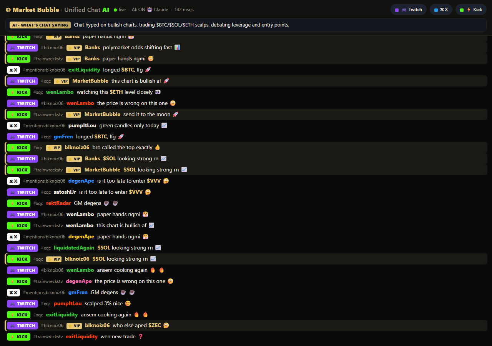
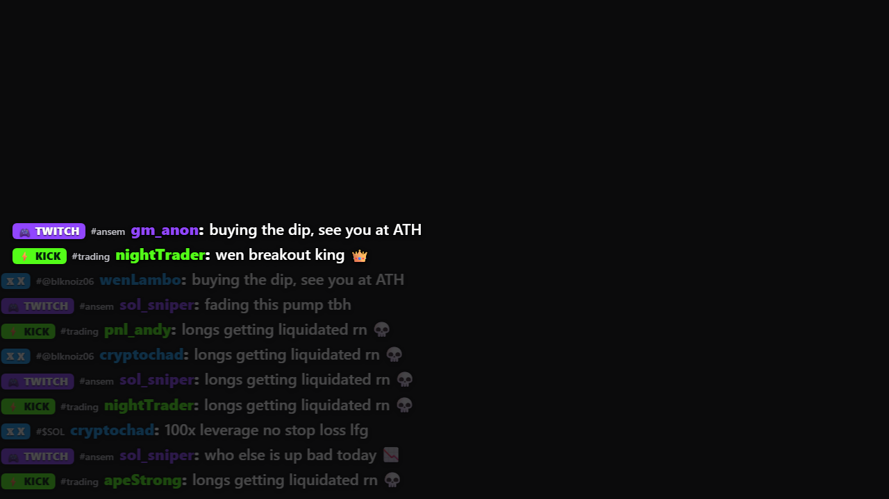
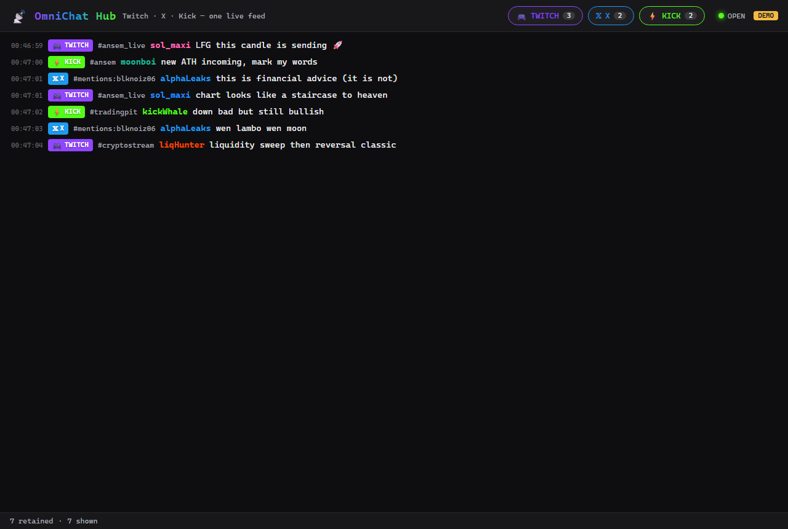

# OmniChat — MarketBubble $10k Challenge

**The brief:** build a unified live-chat aggregator that merges **Twitch + Kick + X** into one labeled, filterable feed for a co-stream show. **This repo ships 10 distinct architectures** of that same product — pick the one that best fits how you want to run the show, all sharing the same three connectors, the same unified message schema, and a zero-config Demo Mode.

> 🏆 **Which should I submit?** For *the show*, in order: **#4 OBS Overlay** (chat literally on the broadcast), **#6 AI-Augmented** (the "we went further" wow — live AI summary + spam/sentiment), **#2 WebSocket Hub** (the safe shareable web app). See [RECORDING_GUIDE.md](RECORDING_GUIDE.md) for the record-and-submit steps + the "anything else" blurb.

### Previews (verified running)

| #6 AI-Augmented (hero) | #4 OBS Overlay | #2 WebSocket Hub |
|---|---|---|
|  |  |  |

The hero runs with **real Claude** (claude-haiku-4-5) for live spam/sentiment + a "what chat is saying" summary, with **$ticker** + **host/⭐VIP** highlighting and a Market Bubble black-&-gold theme. It degrades to a local heuristic if the API is unavailable, so the feed never goes dark on stream.

---

## The 10 builds

| # | Folder | Name | Stack | Differentiator | Run command |
|---|--------|------|-------|----------------|-------------|
| 1 | `01-browser-extension` | OmniChat Extension | Chrome MV3 (vanilla JS service worker + Side Panel, no build) | All 3 sources connect directly from the background worker into the native Chrome Side Panel — load-unpacked, zero build step | Load unpacked in `chrome://extensions`, click the toolbar icon |
| 2 | `02-websocket-hub` | OmniChat Hub | Node (Express + ws) + React (Vite) | Verified end-to-end: server fans out `/ws` frames to a Vite UI, with a built static single-port fallback | `cd 02-websocket-hub && npm install && npm run dev` |
| 3 | `03-edge-durable-object` | OmniChat Edge | Cloudflare Workers + Durable Object (vanilla JS) | One Durable Object holds ONE set of upstreams and fans out to all viewers — 100 viewers = 1 upstream load | `cd 03-edge-durable-object && npm install && npx wrangler dev` |
| 4 | `04-obs-overlay` | OmniChat Overlay | Static HTML/CSS/JS + optional ~40-line Node X-proxy | Transparent OBS overlay; Twitch+Kick are browser-direct (no backend), X token in an optional tiny proxy | `start "overlay.html?demo=1&ui=1"` |
| 5 | `05-go-sse` | OmniChat Go | Go (net/http SSE + go:embed) + gorilla/websocket | Single binary: goroutine-per-source → one hub channel → native SSE to an embedded UI; verified go.sum hashes | `cd 05-go-sse && go run .` |
| 6 | `06-ai-augmented` | OmniChat AI | Python + FastAPI + asyncio + Claude (claude-haiku-4-5) | Claude layer adds per-message spam/toxicity + sentiment and a live 15s "what's chat saying" banner; degrades to plain aggregator without a key | `cd 06-ai-augmented && pip install -r requirements.txt && uvicorn main:app --port 8787` |
| 7 | `07-desktop-electron` | OmniChat Desktop | Electron 30 (Node main) + vanilla renderer | Local-first desktop app — tokens never leave the machine, no server, lowest latency over a sandboxed IPC bridge | `cd 07-desktop-electron && npm install && npm start` |
| 8 | `08-bot-bridge` | OmniChat Bridge | Node (http + fetch) + ws, SSE frontend | Forwards every labeled message to a live web table AND optional Telegram/Discord sinks via a rate-limited batching queue | `cd 08-bot-bridge && npm install && npm start` |
| 9 | `09-saas-nextjs` | OmniChat Cloud | Next.js 14 + Prisma 5 + SQLite + ws | Multi-tenant SaaS: per-room aggregator persists every message to SQLite, streams over SSE, "load history" + msgs/min analytics | `cd 09-saas-nextjs && npm install && npx prisma db push && npm run dev` |
| 10 | `10-bun-hono` | OmniChat Lite | Bun + Hono | Truly one-file backend: a single `server.ts` runs all 3 connectors, fans out over native WS, and serves the UI — fastest cold start | `cd 10-bun-hono && bun install && bun run server.ts` |

---

## Quick start — try any of them

1. **Shared root `.env` is already present** (with the X token) at the repo root. Every app auto-loads it (most also read their own folder `.env`), so the provided keys work without copying anything.
2. **Each app reads the same config vars:**
   - `TWITCH_CHANNELS` — comma-separated Twitch channel logins (e.g. `ansem,trainwreckstv`)
   - `KICK_CHANNELS` — comma-separated Kick slugs (add `KICK_CHATROOM_IDS` to skip slug→id lookup if Cloudflare blocks it)
   - `X_MODE` — `replies` | `mentions` | `hashtag`
   - `X_TARGET` — the username or hashtag to track for `X_MODE`
   - `X_BEARER_TOKEN` — X API v2 token (already in the root `.env`)
3. **DEMO mode works with zero config.** Run any build with no real targets set (or `DEMO=1`) and it streams synthetic, crypto-flavored messages from all three sources every ~800ms — so judges see a labeled, filterable merged feed instantly. Add real channel vars to go live.

All builds share the **unified schema** `{ id, source, channel, author, text, color, ts }`, render **source badges** (🎮 TWITCH purple `#9146FF` / 𝕏 X blue `#1D9BF0` / ⚡ KICK green `#53FC18`), expose **three source-filter toggles**, cap the feed at **500 messages**, **pause auto-scroll** on scroll-up, and **reconnect with exponential backoff**.

---

## How the connectors work

**Twitch — anonymous IRC over WebSocket.** Connect to `wss://irc-ws.chat.twitch.tv`, request the `tags` capability, and log in as an anonymous `justinfan<random>` nick (no token needed). `JOIN` each channel, reply `PONG` to server `PING`, and parse `PRIVMSG` lines — pulling display name and color from IRC tags and keeping the colon-in-body case intact.

**Kick — Pusher WebSocket.** Resolve each channel slug to its numeric `chatroom.id` via Kick's `/api/v2` endpoint (browser User-Agent to dodge Cloudflare; `KICK_CHATROOM_IDS` overrides if blocked), then open the Pusher socket, `pusher:subscribe` to `chatrooms.{id}.v2`, answer `pusher:ping` with `pusher:pong`, and JSON-decode the `App\Events\ChatMessage` event (whose `data` is itself a JSON string).

**X — API v2 recent-search polling.** No streaming on the basic tier, so poll `tweets/search/recent` every ~12s. A query builder maps `X_MODE` (replies/mentions/hashtag) + `X_TARGET` to a search query, `since_id` tracks the last seen tweet to avoid dupes, results are reversed to chronological order, and a `429` triggers exponential backoff. Skips cleanly when no token is present.

---

## Which should I submit?

For a **live co-stream show**, rank:

1. **`06-ai-augmented` (OmniChat AI)** — the only build with a Claude layer. Per-message spam/toxicity + sentiment and the live "what's chat saying" banner turn a raw feed into a *show feature* the host can react to on camera. Highest wow factor, and it still degrades to a plain aggregator with zero config. **Submit this.**
2. **`04-obs-overlay` (OmniChat Overlay)** — purpose-built for streaming: a transparent OBS Browser Source that drops a merged, badged chat straight over the video with no backend for Twitch+Kick. The most directly "ready for the broadcast" entry.
3. **`03-edge-durable-object` (OmniChat Edge)** — the scalability story. One Durable Object means 100 viewers cause 1 upstream load, so if the show's own audience also watches the aggregator page, this is the only architecture that won't melt under fan-out.

**TL;DR:** lead with **06 (AI)** for the demo wow, keep **04 (Overlay)** as the production overlay, and cite **03 (Edge)** as the scaling answer.
